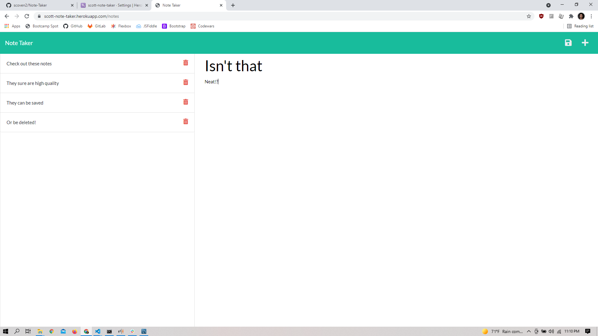

# Note-Taker

## Description
An application that runs in Herokus using node. It allows the user to create a title for each individual note, leave the longer details in body of the note, and save it to a list to be viewed later. When the note is no longer needed, the user can easily delete it from the list.

[Live link](https://scott-note-taker.herokuapp.com/)

 

## Table of contents
- [Description](#description)
- [Installation](#installation)
- [Usage](#usage)
- [License](#license)
- [Contributing](#contributing)
- [Questions](#questions)

## Installation
Clone repository from GitHub, open in VS Code, open new terminal, run npm i, npm install, npm init -y.

## Usage
Open link 

## License
MIT.

## Contributing
Email me if you'd like to become a contributor using the email below

## Questions
[A link to my gitHub](https://github.com/scoven2)  
Email: smiegull@gmail.com